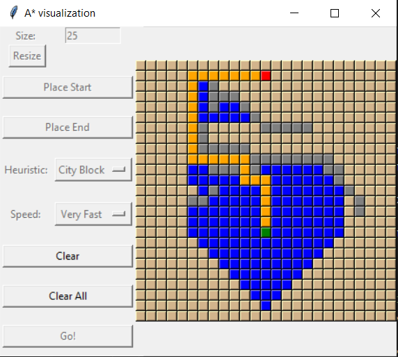
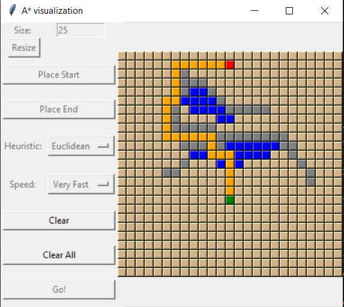

# A* Visualization
### A GUI to watch the A* algorithm find a path from start to end.
### By Alex Tuck

Watch the A* algorithm find a path from start to end. You can place resize the grid, place the Start and End spaces wherever you like, and 
place barriers to cut the path of the algorithm. 

Blue spaces represent explored spaces. Yellow spaces represent the shortest path the algorithm found.

Choose from two heuristics and compare the performance of A* on both of them.
+ City Block Heuristic - The distance from block A to block B the number of steps you need to take to reach B from A.

+ Euclidean Heuristic - The distance between block A and block B is the length of the distance between them.

